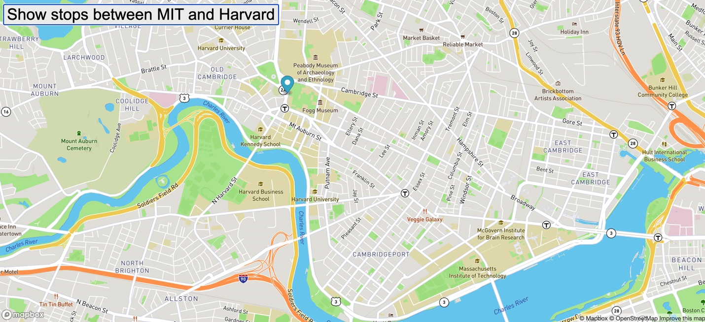

# Bus-tracker 

**Title:** Real Time Bus Tracker

**Description:**  This exercise adds animation to a map using map overlay and DOM manipulation. The result is a bus tracker that runs from the MIT to Harvard campus using actual bus stop latitude and longitude data. 

**How to Run:**  
Clone this project:  
$ git clone https://github.com/kotzinr/Bus-tracker  

Access:  
$ cd Bus-tracker  

Run the project:  
$ open index.html  

**Roadmap of future improvements:** additional features could include times of day that the bus comes to each stop

**License information:** MIT license, listed separately in license file. 
