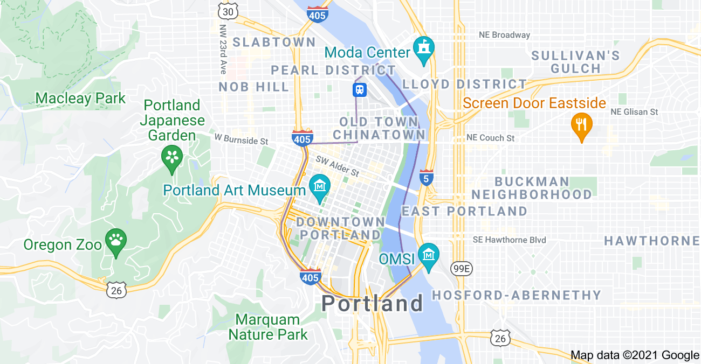

# Bus-tracker 

**Title:** Real Time Bus Tracker

**Description:**  This exercise adds animation to a map using map overlay and DOM manipulation. The result is a bus tracker that runs the MIT to Harvard campuses using actual but stop latitude and longitude data. 

**How to Run:** Download all the files and drag and drop the index.html files on to a blank browser page. 

**Roadmap of future improvements:** additional features could include times of day that the bus comes to each stop

**License information:** MIT license, listed separately in license file. 
